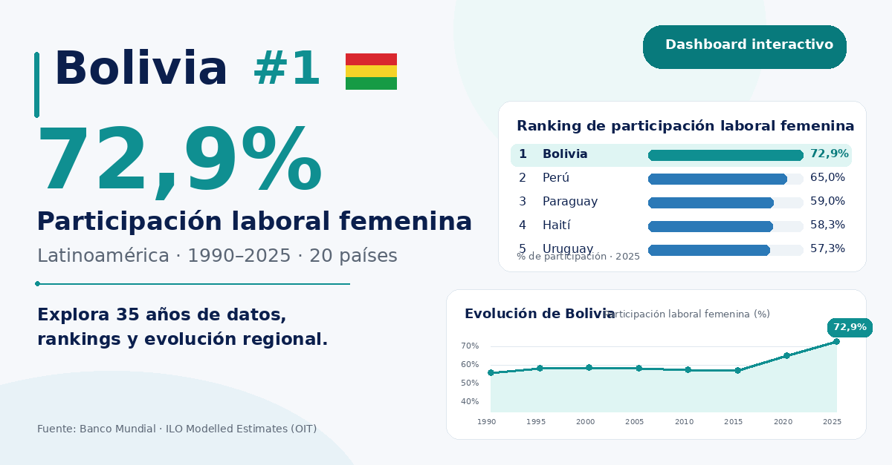

# Participación laboral femenina en América Latina

## 👉 [Abrir el dashboard interactivo](https://marcelomedinanp.github.io/participacion-laboral-femenina-latam/)

Dashboard comparativo de la participación laboral femenina en América Latina. Series históricas y contraste entre países.

---

Autor: [Marcelo Medina](https://linkedin.com/in/marcelomedinanp) · [Portfolio](https://datascienceportfol.io/marcelomedinanp)
